# Push Universal Name Service - System Architecture Diagrams

This document presents the architecture of the Push Universal Name Service system using Mermaid diagrams.

## 1. Overall System Architecture

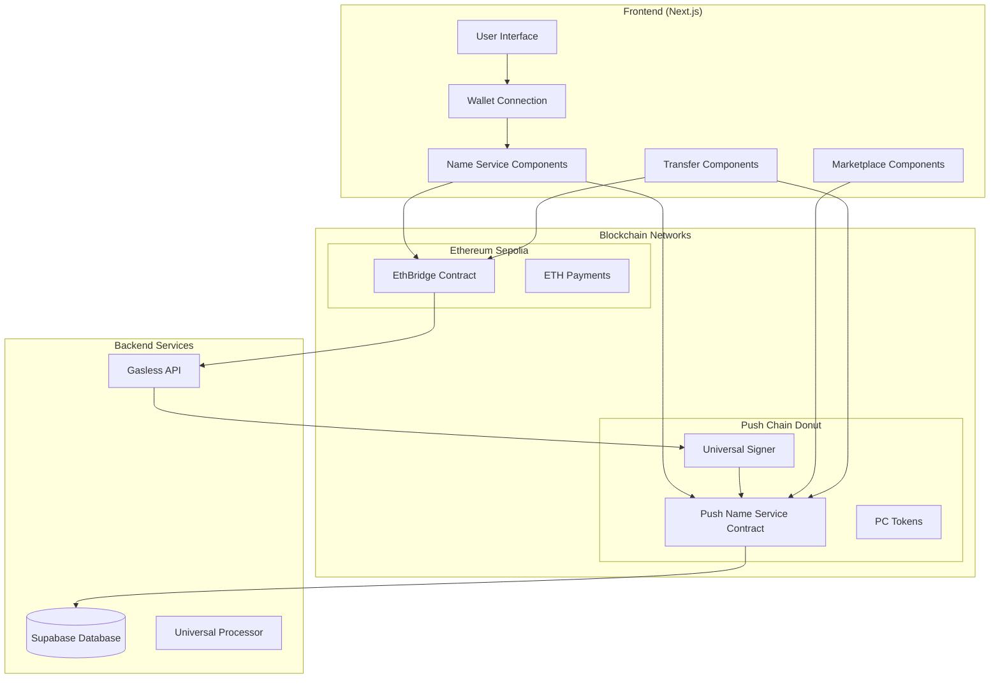

## 2. Domain Registration Flow

### 2.1 Direct Registration (Push Chain)

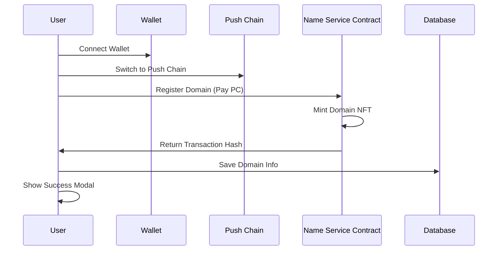

### 2.2 Gasless Registration (Ethereum Sepolia)

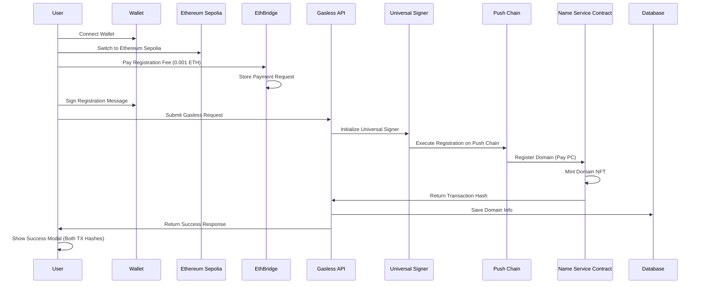

## 3. Universal Bridge System

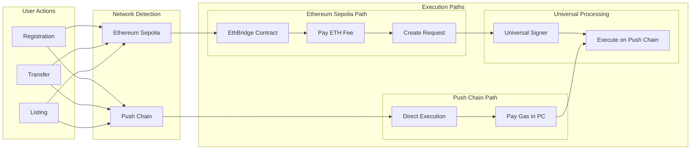

## 4. Domain Transfer System

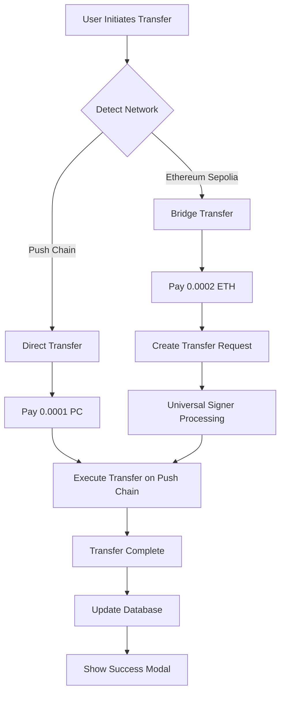

## 5. Marketplace Listing System

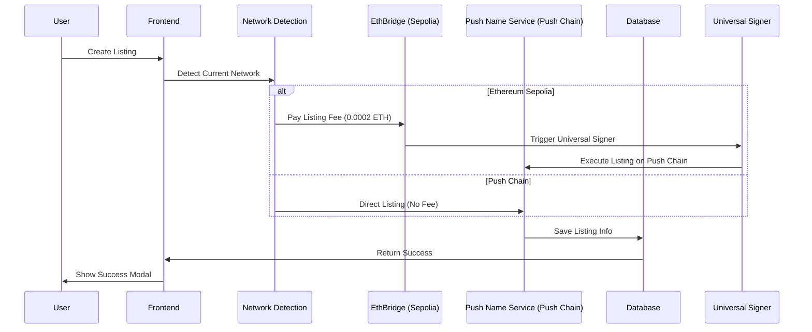

## 6. Universal Signer Architecture

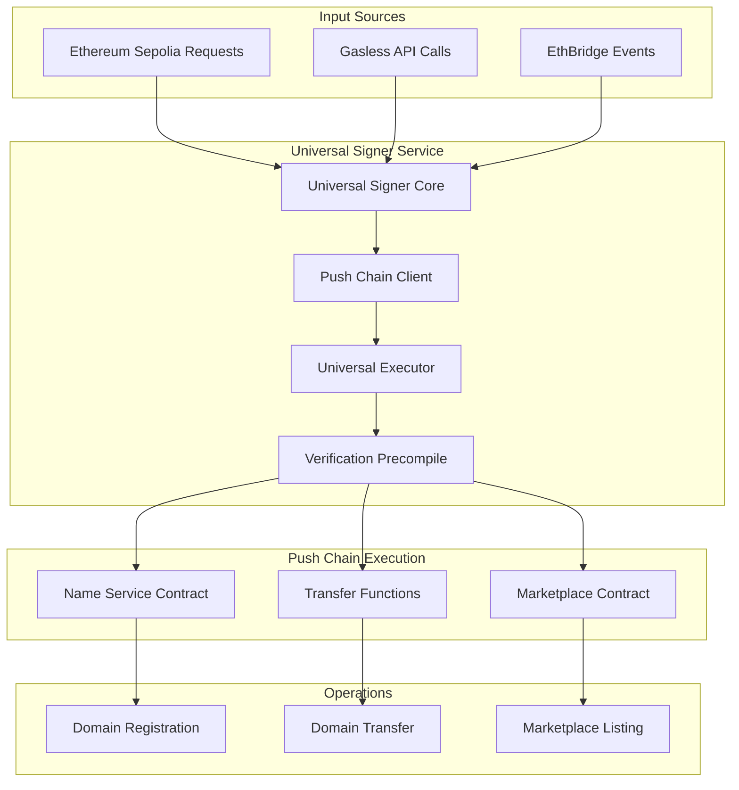

## 7. Database Schema Relations

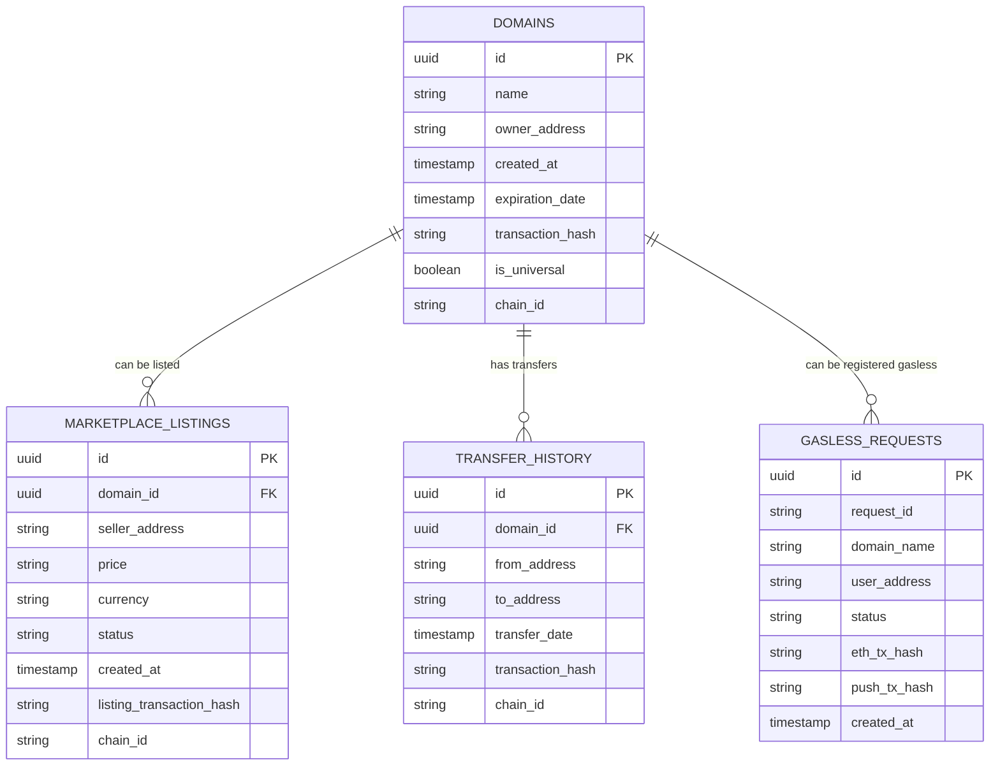

## 8. Component Architecture

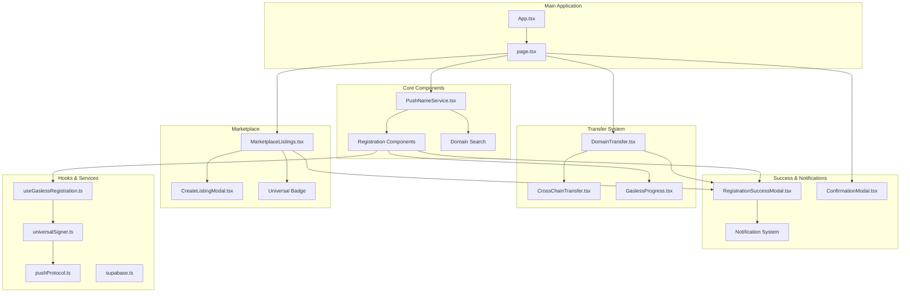

## 9. Network Flow & Chain Interactions

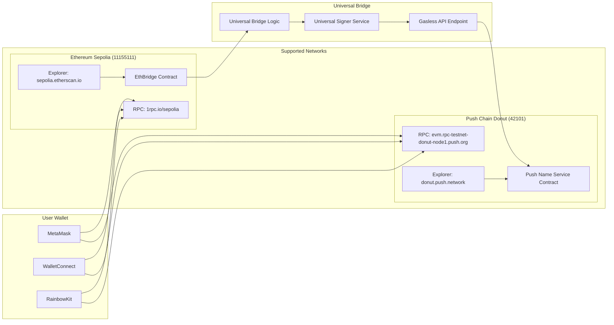

## 10. Fee Structure & Economics

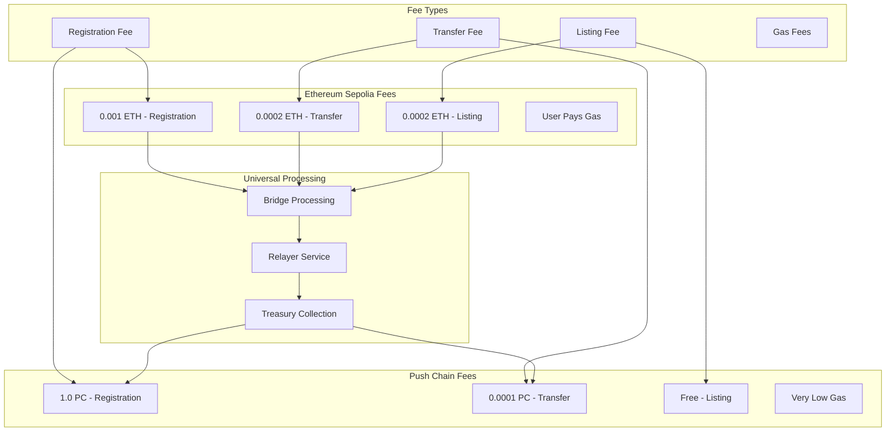

## 11. User Journey Flow

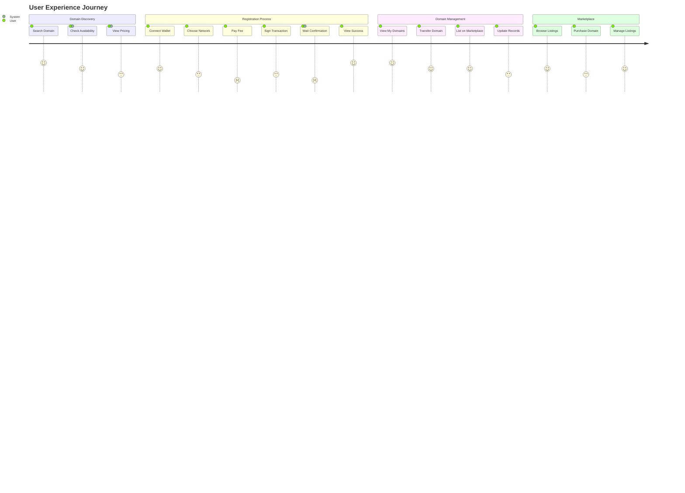

## 12. Error Handling & Recovery

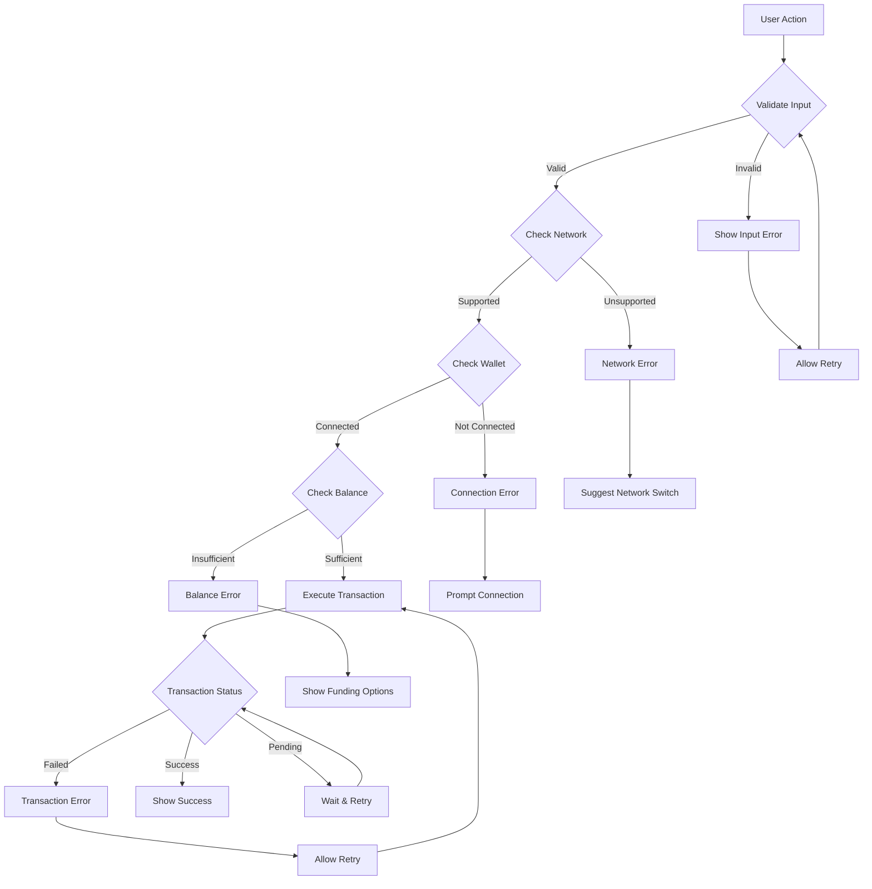

## Notes

- **Universal Signer**: Executes requests from Ethereum Sepolia on Push Chain
- **EthBridge**: Fee collection and request management on Ethereum Sepolia  
- **Gasless Registration**: User only pays domain fee, no gas fees required
- **Cross-Network Support**: Same domain can be used on both Ethereum and Push Chain
- **Explorer Integration**: Appropriate explorer links shown for each transaction
- **Database Sync**: All operations are synchronized in Supabase
- **Error Recovery**: Comprehensive error handling with retry mechanisms
- **User Experience**: Seamless flow across different networks and operations